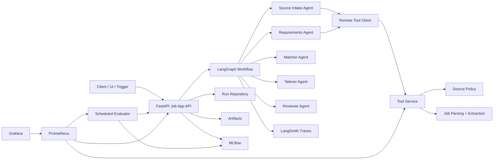

# Job Application Copilot LLMOps

A production-leaning Python project for multi-agent job discovery and application preparation workflows.

It is intentionally modeled after the structure of `multi-agent-research-llmops`, but adapted to the recruiting domain.

See `docs/ARCHITECTURE.md` for the direct mapping from the research reference project to this recruiting platform, including Grafana, MLflow, Prometheus, evaluator, and service-boundary modules.

## What it implements

- a `LangGraph` workflow with six agents:
  - `source_intake`
  - `requirements`
  - `matcher`
  - `tailorer`
  - `reviewer`
  - `similar_jobs`
- a separate remote tool service for:
  - source-policy checks
  - job normalization
  - requirement extraction
- a FastAPI application API
- a React dashboard for operators and reviewers
- persisted run history and approval state
- artifact export for:
  - tailored CV
  - tailored CV as `.docx`
  - tailored CV as `.pdf`
  - motivation letter
  - motivation letter as `.docx`
  - motivation letter as `.pdf`
  - application answers
  - approval packet
  - submission packet
- a local profile vault for uploaded CVs, motivation letters, and reference material
- URL-first intake so the system can fetch job content from a link when possible
- explicit human approval gates before dispatch
- MLflow tracking for runs and evaluations
- Prometheus and Grafana for operational observability
- optional LangSmith tracing for LangGraph node and LLM debugging
- Docker Compose for local deployment
- Azure Container Apps deployment assets and CI/CD workflow

## Architecture



## Core workflow

1. `source_intake`
   Normalizes the incoming job opportunity, checks allowlisted sources, and extracts basic metadata.

2. `requirements`
   Extracts required skills, preferred skills, languages, authorization needs, and likely application questions.

3. `matcher`
   Compares the opportunity against a structured candidate profile and scores the fit.

4. `tailorer`
   If the role clears the threshold and has no hard blockers, generates:
   - tailored CV
   - motivation letter
   - concise question answers
   - approval packet

5. `reviewer`
   Produces the final approval package and stops before dispatch.

6. `similar_jobs`
   When enabled for a run, searches public job pages for closely matching roles and returns ranked links for follow-up tailoring. The default provider is `SerpAPI`, with DuckDuckGo fallback if no SerpAPI key is configured.

After approval, a separate submission action can:

- prepare an email packet
- prepare a company-site submission packet
- prepare a manual LinkedIn / Indeed handoff packet

## Local stack

`docker-compose.yml` includes:

- `postgres` for application state
- `mlflow-db` for MLflow metadata
- `minio` for local MLflow artifacts
- `mlflow` tracking server
- `model` as an optional `vLLM` OpenAI-compatible endpoint
- `api` for the FastAPI job-application service
- `mcp` for the remote tool service
- `evaluator` for scheduled evaluation runs
- `prometheus` and `grafana` for observability

Similar-job discovery configuration:

- `SIMILAR_JOB_SEARCH_PROVIDER=serpapi`
- `SERPAPI_API_KEY=...`
- `SIMILAR_JOB_MIN_SCORE=80`

Optional LangSmith tracing:

- `LANGSMITH_TRACING=true`
- `LANGSMITH_API_KEY=...`
- `LANGSMITH_PROJECT=job-application-copilot-local`
- `LANGSMITH_HIDE_INPUTS=true`
- `LANGSMITH_HIDE_OUTPUTS=true`

Inputs and outputs are hidden by default because runs may contain CVs, motivation letters, email addresses, and application material. The traces still include node names, duration, status, scores, counts, source type, and role/company metadata.

## API surface

- `POST /api/v1/applications/run`
- `POST /api/v1/applications/run-from-url`
- `GET /api/v1/applications/{run_id}`
- `POST /api/v1/applications/{run_id}/similar-jobs`
- `POST /api/v1/applications/{run_id}/approve`
- `POST /api/v1/applications/{run_id}/reject`
- `GET /api/v1/runs`
- `GET /api/v1/profile-vault`
- `GET /api/v1/profile-vault/profile`
- `POST /api/v1/profile-vault/profile`
- `POST /api/v1/profile-vault/upload`
- `GET /ready`
- `GET /metrics`

## Run It

### React dashboard

The operator dashboard lives in `dashboard-ui/` and gives you:

- live run overview
- URL-first and manual submission forms
- profile vault editing and asset uploads
- run review, approval, and rejection
- on-demand similar-job discovery from an existing run
- direct links to Grafana, MLflow, Prometheus, the API, and the tool service

### Lightweight local mode

Use this when you want to run only the API and tool service on your machine without Docker infrastructure.

Open terminal 1:

```powershell
cd "C:\Users\marya\Documents\New project\job-application-copilot-llmops"
python -m uvicorn job_app_ops.mcp_app:app --host 127.0.0.1 --port 8081
```

Open terminal 2:

```powershell
cd "C:\Users\marya\Documents\New project\job-application-copilot-llmops"
$env:DATABASE_URL = "sqlite:///./data/job_applications.db"
$env:MCP_SERVER_URL = "http://127.0.0.1:8081"
$env:MLFLOW_ENABLED = "false"
python -m uvicorn job_app_ops.api.app:app --host 127.0.0.1 --port 8080
```

Check readiness:

```powershell
Invoke-RestMethod http://127.0.0.1:8081/ready
Invoke-RestMethod http://127.0.0.1:8080/ready
```

Notes:

- the API can take around 30 to 50 seconds to finish startup on first run in this environment
- local mode uses SQLite instead of PostgreSQL
- local mode disables MLflow so you do not need the tracking server running

### Full Docker stack

Use this when you want PostgreSQL, MLflow, MinIO, Prometheus, and Grafana as well.

```powershell
cd "C:\Users\marya\Documents\New project\job-application-copilot-llmops"
docker compose up --build
```

Main endpoints:

- Dashboard: `http://127.0.0.1:3002`
- API: `http://127.0.0.1:8082/ready`
- Tool service: `http://127.0.0.1:8083/ready`
- MLflow: `http://127.0.0.1:5001`
- Prometheus: `http://127.0.0.1:9091`
- Grafana: `http://127.0.0.1:3001`

To run only the dashboard locally during frontend development:

```powershell
cd "C:\Users\marya\Documents\New project\job-application-copilot-llmops\dashboard-ui"
npm install
npm run dev
```

The Vite dev server proxies:

- `/api` to `http://127.0.0.1:8082`
- `/ready`, `/live`, `/metrics` to the main API
- `/tool-api` to `http://127.0.0.1:8083/api/v1/tools`

### Azure deployment

The recommended Azure target for this project is:

- Azure Container Apps for the running services
- Azure Container Registry for image storage
- Azure Database for PostgreSQL Flexible Server for state
- Azure Files for generated artifacts and MLflow artifacts
- Log Analytics for container logs

Azure deployment assets are under:

- `ops/azure/main.bicep`
- `ops/azure/deploy.ps1`
- `.github/workflows/azure-container-apps.yml`

The local deployment script can read the shared LLM settings from:

- `C:\Users\marya\Documents\New project\multi-agent-research-llmops\.env`

Use:

```powershell
cd "C:\Users\marya\Documents\New project\job-application-copilot-llmops"
.\ops\azure\deploy.ps1 `
  -EnvironmentName test `
  -Location "switzerlandnorth" `
  -SharedEnvPath "C:\Users\marya\Documents\New project\multi-agent-research-llmops\.env" `
  -PostgresAdminUser "jobappadmin" `
  -PostgresAdminPassword "<strong-password>" `
  -McpClientAuthToken "<shared-tool-token>" `
  -GrafanaAdminPassword "<grafana-password>" `
  -ImageTag "manual-001"
```

The GitHub Actions workflow deploys `test` on pushes to `main`; manual dispatch can deploy `test`, `prod`, or both. For the full Azure setup and GitHub secrets mapping, see `ops/azure/README.md`.

Optional GPU model service:

```powershell
docker compose --profile gpu up --build
```

## URL-Only Workflow

Use this flow when you want to give the system only a job link and let it fetch the description automatically.

1. Upload prior materials into the local profile vault:

```powershell
curl.exe -X POST "http://127.0.0.1:8082/api/v1/profile-vault/upload?kind=cv" -F "file=@C:\path\to\previous-cv.docx"
curl.exe -X POST "http://127.0.0.1:8082/api/v1/profile-vault/upload?kind=motivation_letter" -F "file=@C:\path\to\sample-letter.docx"
curl.exe -X POST "http://127.0.0.1:8082/api/v1/profile-vault/upload?kind=reference_letter" -F "file=@C:\path\to\reference.pdf"
```

2. Submit only the job URL:

```powershell
$body = @{
  profile_id = 'primary-candidate'
  source_url = 'https://www.linkedin.com/jobs/view/4328133201/'
  source_type = 'saved_search'
  destination = 'https://www.linkedin.com/jobs/view/4328133201/'
  submission_channel = 'manual_handoff'
}

$run = Invoke-RestMethod `
  -Uri 'http://127.0.0.1:8082/api/v1/applications/run-from-url' `
  -Method Post `
  -ContentType 'application/json' `
  -Body ($body | ConvertTo-Json -Depth 10)

$run | ConvertTo-Json -Depth 12
```

3. Approve the generated packet:

```powershell
Invoke-RestMethod `
  -Uri "http://127.0.0.1:8082/api/v1/applications/$($run.run_id)/approve" `
  -Method Post `
  -ContentType 'application/json' `
  -Body '{"send_email_now":false}'
```

Generated artifacts are written under:

- `data/artifacts/<run_id>/...`
- `data/reports/<run_id>/...`

For CV and motivation letter artifacts, the exporter writes:

- Markdown
- Word `.docx`
- PDF `.pdf`

See `docs/URL_ONLY_PROFILE_VAULT.md` for a fuller walkthrough.

## Project structure

```text
job-application-copilot-llmops/
  job_app_ops/
    api/
    agents/
    graph/
    services/
  ops/
    azure/
    evals/
    grafana/
    mlflow/
    prometheus/
```

## Intended use

This project is a generic Python/LangGraph definition of the recruiting system you described earlier:

- read opportunities from approved sources
- extract requirements
- compare them with profile and evidence
- score fit
- generate tailored artifacts only when the policy allows it
- require operator approval before sending or submitting

It is not a blind auto-apply bot.
