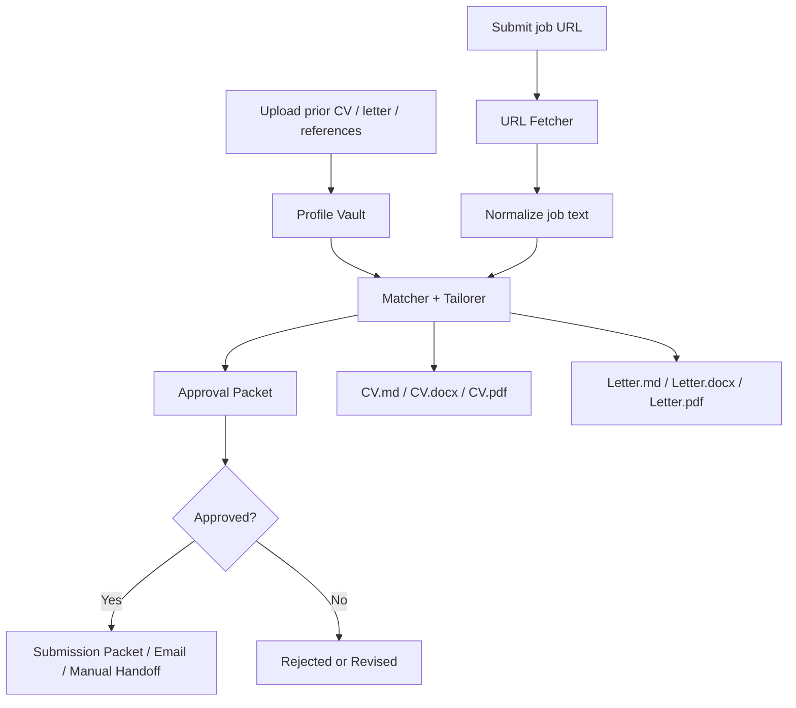

# URL-Only Intake and Profile Vault

This project now supports a local-first flow where the operator can:

- upload previous CVs
- upload motivation-letter samples
- upload reference letters
- submit a job by URL instead of pasting the full description
- generate a tailored CV and motivation letter automatically
- receive `.md`, `.docx`, and `.pdf` outputs for CV and motivation letter

## How It Works



## Supported Local Uploads

The profile vault can ingest:

- `.txt`
- `.md`
- `.html`
- `.docx`
- `.pdf`

Uploaded materials are stored locally under:

- `data/profiles/profile-vault.json`
- `data/profiles/uploads/`

## Upload Previous Materials

```powershell
curl.exe -X POST "http://127.0.0.1:8082/api/v1/profile-vault/upload?kind=cv" -F "file=@C:\path\to\previous-cv.docx"
curl.exe -X POST "http://127.0.0.1:8082/api/v1/profile-vault/upload?kind=motivation_letter" -F "file=@C:\path\to\sample-letter.docx"
curl.exe -X POST "http://127.0.0.1:8082/api/v1/profile-vault/upload?kind=reference_letter" -F "file=@C:\path\to\reference.pdf"
```

Check the current vault:

```powershell
Invoke-RestMethod "http://127.0.0.1:8082/api/v1/profile-vault" | ConvertTo-Json -Depth 10
```

## Submit a Job URL

### LinkedIn / Indeed

Use `manual_handoff` for LinkedIn or Indeed style workflows:

```powershell
$body = @{
  profile_id = 'primary-candidate'
  source_url = 'https://www.linkedin.com/jobs/view/4328133201/'
  source_type = 'saved_search'
  destination = 'https://www.linkedin.com/jobs/view/4328133201/'
  submission_channel = 'manual_handoff'
}

$run = Invoke-RestMethod `
  -Uri 'http://127.0.0.1:8082/api/v1/applications/run-from-url' `
  -Method Post `
  -ContentType 'application/json' `
  -Body ($body | ConvertTo-Json -Depth 10)
```

### Company ATS Page

Use `company_site` when the target can be handled as a company-site packet:

```powershell
$body = @{
  profile_id = 'primary-candidate'
  source_url = 'https://boards.greenhouse.io/example/jobs/1234567'
  source_type = 'company_site'
  destination = 'https://boards.greenhouse.io/example/jobs/1234567'
  submission_channel = 'company_site'
}

$run = Invoke-RestMethod `
  -Uri 'http://127.0.0.1:8082/api/v1/applications/run-from-url' `
  -Method Post `
  -ContentType 'application/json' `
  -Body ($body | ConvertTo-Json -Depth 10)
```

## Inspect and Approve

```powershell
Invoke-RestMethod "http://127.0.0.1:8082/api/v1/applications/$($run.run_id)" | ConvertTo-Json -Depth 12
```

Approve:

```powershell
Invoke-RestMethod `
  -Uri "http://127.0.0.1:8082/api/v1/applications/$($run.run_id)/approve" `
  -Method Post `
  -ContentType 'application/json' `
  -Body '{"send_email_now":false}' `
  | ConvertTo-Json -Depth 12
```

## Output Locations

Generated files are written locally under:

- `data/artifacts/<run_id>/`
- `data/reports/<run_id>/`

Typical artifact set:

- `*-cv.md`
- `*-cv.docx`
- `*-cv.pdf`
- `*-motivation-letter.md`
- `*-motivation-letter.docx`
- `*-motivation-letter.pdf`
- `*-answers.md`
- `*-approval-packet.md`

## Notes

- The system tries to fetch the job description from the URL automatically.
- Some sites may still require authentication or block scraping.
- LinkedIn jobs can be routed through guest-access fallbacks when public job metadata is available.
- The operator approval gate still remains mandatory before dispatch.
