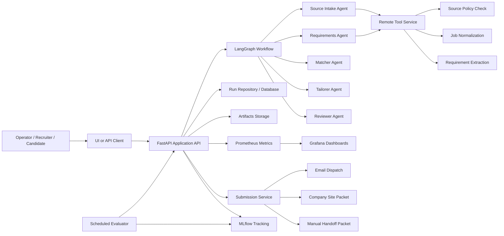
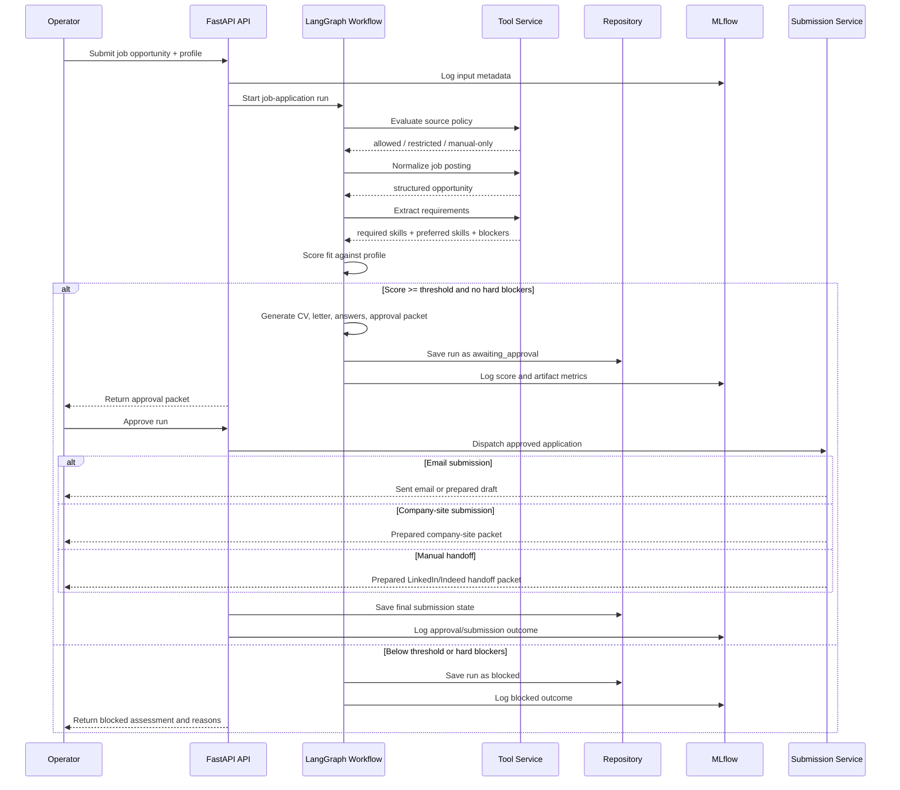
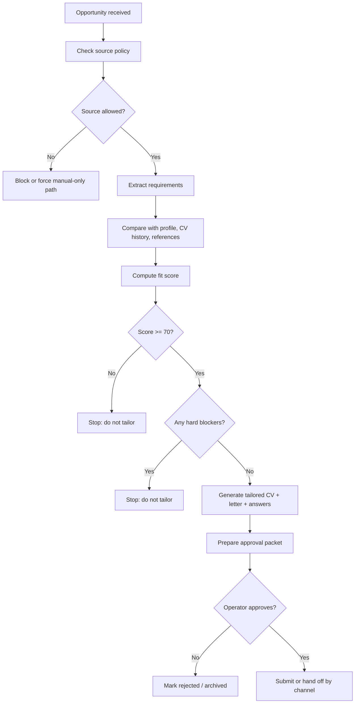
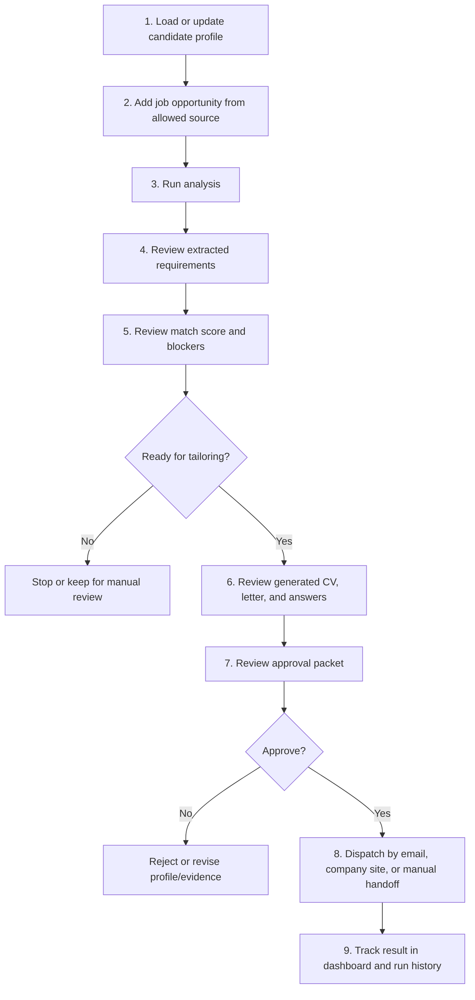

# Job Application Copilot Workflow Diagrams

This document explains how the proposed Python application works, which components participate, and the sequence in which the system should be used.

## 1. System overview

## 2. Runtime sequence

This is the end-to-end sequence for one job application opportunity.

## 3. Decision logic

## 4. Operator usage sequence

This is the recommended order in which the system should be used.

## 5. Recommended operating sequence

Use the application in this order:

1. Maintain the candidate profile vault first.
2. Ingest only approved job sources.
3. Run requirement extraction and fit scoring.
4. Allow tailoring only when the score clears the threshold and there are no hard blockers.
5. Review all generated artifacts before approval.
6. Approve only the applications you actually want sent.
7. Let the system dispatch only after approval.
8. Monitor blocked runs, approval rates, and submission outcomes in Grafana and MLflow.

## 6. What each module is responsible for

- `FastAPI API`
  Receives requests, returns results, and exposes health and metrics endpoints.

- `LangGraph Workflow`
  Orchestrates the full multi-agent pipeline.

- `Tool Service`
  Handles source-policy checks, normalization, and structured extraction.

- `Matcher`
  Scores the role against the structured candidate profile and evidence.

- `Tailorer`
  Produces the tailored CV, motivation letter, and application answers.

- `Reviewer`
  Builds the approval packet and stops before dispatch.

- `Submission Service`
  Handles email sending, company-site packets, or manual handoff packages after approval.

- `Repository`
  Stores runs, states, and outcomes.

- `MLflow`
  Tracks run metadata, scores, and evaluation outcomes.

- `Prometheus + Grafana`
  Tracks operational health, throughput, durations, and blocked-vs-approved trends.
